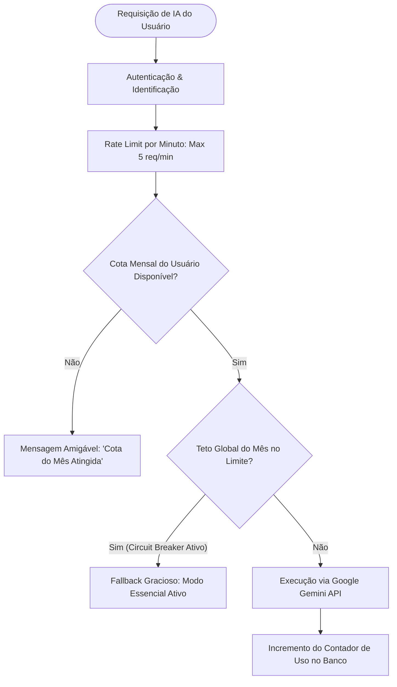

# ☕ Modelo Freemium Solidário & Sustentabilidade

## 1. A Realidade de uma Plataforma Independente

O **Academic Companion** não é financiado por fundos de capital de risco (*Venture Capital*) nem possui orçamento corporativo ilimitado. Ele é concebido, desenvolvido e mantido de forma independente por um estudante e pesquisador para a comunidade acadêmica.

Manter uma plataforma moderna no ar envolve custos reais fixos e variáveis:

```text
Custos Fixos (Infraestrutura Base):
├── Servidor VPS Linux de Hospedagem
├── Banco de Dados Relacional PostgreSQL Gerenciado
├── Armazenamento de Objetos (MinIO / S3) para Certificados e Mídias
└── Certificados SSL, DNS e Registro de Domínio

Custos Variáveis Marginais (Uso Intensivo de Computação Externa):
├── Tokens de Entrada e Saída da Google Gemini API (Chat Conversacional)
├── Minutos de Áudio Processados para Transcrição (Speech-to-Text)
└── Processamento Multimodal de Imagens e PDFs Escaneados (OCR / Visão)
```

Enquanto os custos fixos de banco de dados e servidor conseguem atender a milhares de estudantes com valores estáveis, **os custos de chamadas a APIs de Inteligência Artificial crescem linearmente a cada interação**. Sem um modelo de proteção e sustentabilidade financeira, uma única semana de uso descontrolado ou ataques de bots poderia gerar faturas proibitivas, inviabilizando a continuidade do projeto.

---

## 2. A Filosofia: Humildade, Transparência e Solidariedade

Para resolver essa equação sem desvirtuar o propósito social do produto, o Academic Companion adota uma política clara e inegociável:

> **Nenhum estudante será excluído das ferramentas fundamentais de sua trajetória por falta de recursos financeiros.**

### Princípios da Sustentabilidade
1. **Recursos Estruturais 100% Gratuitos para Sempre:** Perfil acadêmico, diário de memórias em texto, linha do tempo interativa, cadastro de experiências, catálogo de produções científicas, validação de certificados e planejamento semestral de disciplinas **nunca terão paywall**.
2. **Igualdade de Acesso com Degustação Justa:** O plano gratuito inclui uma cota mensal saudável de IA para que qualquer estudante consiga testar a transcrição de voz e consultar o copiloto em momentos decisivos.
3. **Cobrança Simbólica e Afetuosa:** Os planos pagos não visam lucro predatório, mas a cobertura real dos custos operacionais dos estudantes que utilizam a IA com alta frequência.
4. **Valores Acessíveis ao Bolso Estudantil:** Nenhuma modalidade de assinatura ultrapassa o teto máximo de **R$ 9,90 por mês**.

---

## 3. A Metáfora do "Cardápio Universitário" (Pague um Lanche)

Em vez de nomenclaturas corporativas frias ("Tier Basic", "Enterprise", "Corporate"), a página de apoio financeiro do Academic Companion apresenta ao usuário um **Cardápio Universitário**, inspirado nos preços reais praticados nas lanchonetes de campus e no Restaurante Universitário (RU):

```text
┌────────────────────────────────────────────────────────────────────────┐
│                        CARDÁPIO SOLIDÁRIO                              │
├───────────────────┬───────────────────┬────────────────────────────────┤
│ Opção de Apoio    │ Valor Mensal      │ O que você está bancando?      │
├───────────────────┼───────────────────┼────────────────────────────────┤
│ ☕ Um Cafezinho   │ R$ 2,90 / mês     │ Cobre o armazenamento seguro   │
│                   │                   │ e o banco de dados da sua conta│
├───────────────────┼───────────────────┼────────────────────────────────┤
│ 🥐 Um Pão de      │ R$ 5,90 / mês     │ Cobre os servidores e uma cota │
│    Queijo/Salgado │                   │ ampla de transcrição e IA      │
├───────────────────┼───────────────────┼────────────────────────────────┤
│ 🥪 Um Sanduíche / │ R$ 9,90 / mês     │ Apoio integral: viabiliza o uso│
│    Almoço do RU   │                   │ intensivo de IA e novos editais│
└───────────────────┴───────────────────┴────────────────────────────────┘
```

O estudante escolhe voluntariamente qual item do cardápio deseja "mandar para o desenvolvedor" a cada mês. Essa abordagem desmistifica a assinatura: o aluno entende que, pelo preço de um simples café no intervalo das aulas, ele mantém seus dados salvos, ganha mais cotas de inteligência e ajuda a manter a plataforma viva para colegas que não podem pagar.

---

## 4. Política de Uso Justo e Cotas Mensais (*Fair Use Policy*)

Todos os planos possuem cotas mensais bem delineadas. As cotas se renovam automaticamente a cada 30 dias:

| Recurso / Módulo | Gratuito (Livre) | ☕ Cafezinho (R$ 2,90) | 🥐 Pão de Queijo (R$ 5,90) | 🥪 Almoço RU (R$ 9,90) |
|---|---|---|---|---|
| **Perfil Acadêmico & Trajetória** | Ilimitado | Ilimitado | Ilimitado | Ilimitado |
| **Diário de Memória (Texto)** | Ilimitado | Ilimitado | Ilimitado | Ilimitado |
| **Linha do Tempo & Projetos** | Ilimitado | Ilimitado | Ilimitado | Ilimitado |
| **Upload de Certificados (PDF/PNG)** | Até 50 docs | Até 150 docs | Até 500 docs | Ilimitado |
| **Transcrição de Voz (Speech-to-Text)** | 15 min / mês | 60 min / mês | 180 min / mês | 400 min / mês |
| **Mensagens ao Copiloto (IA)** | 20 msgs / mês | 100 msgs / mês | 300 msgs / mês | 800 msgs / mês |
| **Parsing Automático de Editais** | 3 editais / mês | 10 editais / mês | 25 editais / mês | 60 editais / mês |
| **Exportação de Dossiês e PDF** | 3 / mês | Ilimitado | Ilimitado | Ilimitado |
| **Selo de Apoiador no Perfil** | — | ☕ Apoiador Café | 🥐 Apoiador Lanche | 🥪 Mantenedor RU |

---

## 5. Salvaguardas Financeiras e *Circuit Breakers*

Para garantir que a plataforma nunca gere prejuízo financeiro pessoal para o mantenedor, a arquitetura implementa proteções automáticas em múltiplas camadas:



### Mecanismos de Proteção:
1. **Rate Limiting Estrito:** Nenhum usuário (mesmo pagante) pode disparar mais de 5 chamadas de IA por minuto, prevenindo scripts automatizados maliciosos.
2. **Cache Semântico de Editais:** Quando um edital público (ex: PIBIC da UFSM) é processado pela primeira vez, o resumo estruturado e os requisitos são cacheados no banco de dados. Qualquer outro estudante que consulte o mesmo edital consome **zero tokens de IA**.
3. **Teto Orçamentário Global (*Circuit Breaker*):** O mantenedor define um orçamento máximo mensal (ex: R$ 100,00 no Google Cloud Console). Caso 95% do teto seja atingido antes do fim do mês, o sistema desativa temporariamente chamadas de IA não essenciais de forma elegante, alertando a comunidade sobre o alto volume do mês, sem interromper as funções de banco de dados e memória textual.

---

## 6. Integração Técnica com o Stripe

A monetização solidária utiliza o **Stripe** como infraestrutura de pagamento segura, internacional e compatível com Pix, Cartão de Crédito e Boleto.

### Fluxo de Assinatura via Stripe Checkout:
1. **Seleção do Item do Cardápio:** Na página `/settings/support`, o estudante visualiza o cardápio e clica em "Pagar um Cafezinho" (`price_cafezinho_monthly`).
2. **Redirecionamento Seguro:** O frontend chama `POST /api/billing/checkout-session`, e o backend gera uma sessão oficial do **Stripe Checkout Hosted** com modo `subscription`.
3. **Pagamento Concluído:** O Stripe processa a cobrança e redireciona o usuário para `/settings/support?status=success`.
4. **Processamento via Webhook:** O Stripe dispara o evento `checkout.session.completed` e `invoice.payment_succeeded` para o endpoint seguro do backend (`/api/billing/webhook`).
5. **Ativação Imediata de Cotas:** O backend identifica o `userId` nos metadados da sessão, atualiza o status para `ACTIVE` e expande as cotas mensais de transcrição e copiloto.

### Autoatendimento via Stripe Customer Portal:
O estudante possui autonomia total para alterar seu valor de apoio ou cancelar a qualquer instante sem burocracia, acessando diretamente o **Stripe Customer Portal** com um clique no painel de configurações.

---

## 7. Modelagem de Dados no Prisma ORM

Para gerenciar assinaturas, pagamentos e cotas de uso justo no banco relacional PostgreSQL, o schema do backend incorpora os seguintes modelos:

```prisma
enum SubscriptionTier {
  FREE        // Acesso Livre Universitário (R$ 0)
  COFFEE      // Cafezinho (R$ 2,90/mês)
  SNACK       // Pão de Queijo / Salgado (R$ 5,90/mês)
  MEAL        // Almoço RU (R$ 9,90/mês)
}

enum SubscriptionStatus {
  ACTIVE
  CANCELED
  PAST_DUE
  INCOMPLETE
}

model UserSubscription {
  id                   String             @id @default(uuid())
  userId               String             @unique
  user                 Student            @relation(fields: [userId], references: [id], onDelete: Cascade)
  tier                 SubscriptionTier   @default(FREE)
  status               SubscriptionStatus @default(ACTIVE)
  stripeCustomerId     String?            @unique
  stripeSubscriptionId String?            @unique
  currentPeriodStart   DateTime           @default(now())
  currentPeriodEnd     DateTime
  createdAt            DateTime           @default(now())
  updatedAt            DateTime           @updatedAt
}

model MonthlyUsageQuota {
  id                   String             @id @default(uuid())
  userId               String
  user                 Student            @relation(fields: [userId], references: [id], onDelete: Cascade)
  billingMonth         String             // Formato "YYYY-MM" (ex: "2026-03")
  audioMinutesUsed     Int                @default(0)
  assistantMessagesUsed Int               @default(0)
  parsedDocumentsCount Int                @default(0)
  createdAt            DateTime           @default(now())
  updatedAt            DateTime           @updatedAt

  @@unique([userId, billingMonth])
}
```

Essa estrutura assegura que o sistema permaneça financeiramente saudável, transparente com seus usuários e fiel ao seu compromisso de transformar a trajetória universitária de forma democrática e sustentável.
