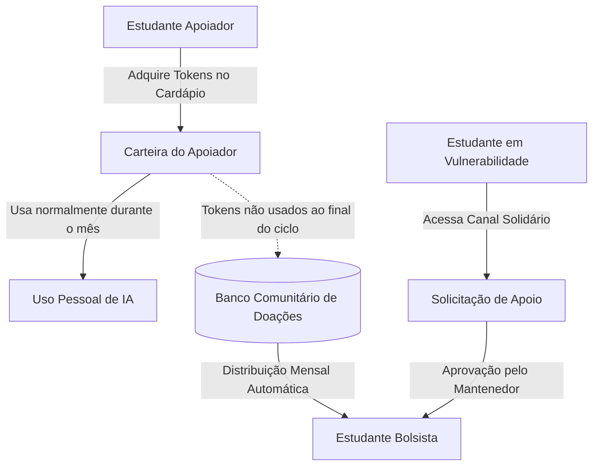

# 🪙 Economia de Tokens, Valor Livre & Doações

## 1. A Realidade de uma Plataforma Independente

O **Academic Companion** é desenvolvido e mantido de forma autônoma e independente para a comunidade acadêmica. Diferente de grandes corporações, a plataforma não possui orçamento infinito para absorver faturas de provedores de nuvem e APIs de Inteligência Artificial.

Para garantir que o projeto seja perene, saudável e confiável, a gestão de custos divide-se em duas frentes:

```text
Custos Fixos (Infraestrutura Base):
├── Servidor VPS Linux de Hospedagem
├── Banco de Dados Relacional PostgreSQL
├── Armazenamento de Objetos (MinIO / S3) para Certificados e Mídias
└── Certificados SSL, DNS e Registro de Domínio

Custos Variáveis Marginais (Computação Externa de Inteligência Artificial):
├── Chamadas à Google Gemini API (Chat Contextual e RAG)
├── Processamento de Áudio para Transcrição (Speech-to-Text)
└── Leitura de Imagens e PDFs Escaneados (Visão Computacional e OCR)
```

Enquanto a infraestrutura de banco de dados e servidor atende a milhares de estudantes com um custo fixo baixo e estável, **as chamadas de IA geram custos a cada token processado**.

---

## 2. A Filosofia: Acesso Livre, Humildade e Solidariedade

Para viabilizar a plataforma sem recorrer a barreiras excludentes, o Academic Companion adota três preceitos fundamentais:

1. **Recursos Estruturais 100% Gratuitos e Ilimitados:** Cadastro de perfil, diário acadêmico em texto, linha do tempo interativa, catálogo de experiências, portfólio, upload de certificados, calculadora de horas complementares e planejamento semestral de disciplinas **nunca custarão nada e não consomem tokens**.
2. **Economia Unificada de Tokens:** Em vez de cotas fragmentadas e confusas ("X minutos disso, Y mensagens daquilo"), **toda e qualquer operação que envolva IA é medida em uma única moeda interna: Tokens do Academic Companion (`Tk`)**.
3. **Liberdade com Margem Justa e Fundo Solidário:** O usuário escolhe livremente quanto quer contribuir a partir de um valor mínimo simbólico. O sistema garante **25% de margem de segurança/lucro para o mantenedor**, e as sobras de tokens não utilizadas no mês são migradas para um **Banco Comunitário de Doações** para estudantes que não têm como pagar.

---

## 3. Tabela Unificada de Consumo de Tokens

Toda ação que demanda poder computacional externo tem seu custo fixado em tokens (`Tk`), calculado proporcionalmente ao custo de inferência do modelo Google Gemini:

| Ação do Usuário | Custo em Tokens | O que é executado por baixo dos panos? |
|---|---|---|
| **1 Minuto de Áudio Transcrito** | **10 Tk** | Processamento de áudio via Gemini Audio e pontuação automática. |
| **1 Pergunta / Mensagem ao Copiloto** | **5 Tk** | RAG com injeção do histórico de memórias e síntese contextual. |
| **1 Edital em PDF Analisado** | **25 Tk** | Leitura de múltiplas páginas, extração de datas, requisitos e resumo. |
| **1 Validação OCR de Certificado** | **15 Tk** | Visão computacional para leitura de autenticidade e carga horária. |
| **1 Diagnóstico Profundo de Trajetória** | **20 Tk** | Análise de lacunas de competências e recomendações estratégicas. |
| **Diário em Texto, Timeline e Metas** | **0 Tk (Grátis)** | Operações diretas no PostgreSQL sem consumo de IA. |

---

## 4. O Cardápio Dinâmico com Valor Livre & Margem de 25%

O estudante tem **liberdade total para escolher o valor que deseja contribuir via Stripe**, existindo apenas um piso mínimo para absorver a taxa da transação bancária.

### O Piso Mínimo Operacional: "Uma Garrafinha de Água" (~R$ 2,50)
O menor valor possível de contribuição é o preço de uma água mineral no campus (**R$ 2,50**). Esse piso cobre a taxa fixa do gateway de pagamento (Stripe: ~R$ 0,39 + 3,99%) e garante que cada transação gere saldo positivo de tokens.

### A Metáfora Visual do Cardápio Universitário
O cardápio funciona como uma referência visual intuitiva e interativa: conforme o estudante ajusta o valor em reais, o sistema simula em tempo real o saldo de tokens e o poder de compra equivalente:

```text
┌────────────────────────────────────────────────────────────────────────────────────────┐
│                              CARDÁPIO SOLIDÁRIO DINÂMICO                               │
├─────────────────────────┬───────────┬──────────┬───────────────────────────────────────┤
│ Opção / Atalho Visual   │ Valor R$  │ Tokens   │ Poder de Compra Equivalente           │
├─────────────────────────┼───────────┼──────────┼───────────────────────────────────────┤
│ 💧 Garrafinha de Água   │ R$ 2,50   │ 150 Tk   │ ~15 min de áudio OU 30 perguntas ao   │
│    (Piso Mínimo)        │           │          │ copiloto OU 6 editais analisados      │
├─────────────────────────┼───────────┼──────────┼───────────────────────────────────────┤
│ ☕ Cafezinho do Campus   │ R$ 5,00   │ 350 Tk   │ ~35 min de áudio OU 70 perguntas OU   │
│                         │           │ (+16% Tk)│ 14 editais completos                  │
├─────────────────────────┼───────────┼──────────┼───────────────────────────────────────┤
│ 🥐 Pão de Queijo/Salgado│ R$ 7,50   │ 570 Tk   │ ~57 min de áudio OU 114 perguntas OU  │
│                         │           │ (+26% Tk)│ 22 editais completos                  │
├─────────────────────────┼───────────┼──────────┼───────────────────────────────────────┤
│ 🥪 Almoço do RU / Lanche│ R$ 10,00  │ 800 Tk   │ ~80 min de áudio OU 160 perguntas OU  │
│                         │           │ (+33% Tk)│ 32 editais completos                  │
├─────────────────────────┼───────────┼──────────┼───────────────────────────────────────┤
│ 🍛 Refeição Especial    │ R$ 20,00  │ 1.800 Tk │ ~180 min de áudio OU 360 perguntas OU │
│                         │           │ (+50% Tk)│ 72 editais completos                  │
├─────────────────────────┼───────────┼──────────┼───────────────────────────────────────┤
│ 🌟 Valor Personalizado  │ Digite R$ │ Dinâmico │ Simulação imediata de tokens e bônus  │
└─────────────────────────┴───────────┴──────────┴───────────────────────────────────────┘
```

### Cálculo da Margem de Sustentabilidade (25% Líquido)
A precificação do token é matematicamente calibrada para que, após deduzidas as taxas do Stripe e os custos diretos da API Gemini, **exatamente 25% do valor permaneça como margem líquida para o mantenedor**. Esse recurso financia a hospedagem, o backup do banco e recompensa o esforço contínuo de engenharia.

---

## 5. O Banco Comunitário de Doação de Tokens (*Token Pool*)

Nem todo estudante tem condições de pagar, mesmo valores acessíveis como R$ 2,50. Por outro lado, muitos apoiadores compram pacotes e não utilizam todos os tokens no mês. O Academic Companion transforma essa sobra em impacto comunitário:



### Como Funciona o Ciclo Solidário:
1. **Migração Automática de Sobras:** Ao término do ciclo mensal de 30 dias, os tokens que o apoiador não consumiu **não expiram nem são confiscados**: eles são depositados no **Banco Comunitário de Doações**.
2. **Reconhecimento ao Apoiador:** O painel do apoiador exibe com orgulho o impacto de sua sobra: *"Neste mês, 120 tokens não utilizados por você foram doados para colegas que precisavam de apoio para buscar bolsas."*
3. **Canal Aberto de Solicitação Solidária:**
   * Qualquer estudante que declare vulnerabilidade financeira pode acessar o canal solidário na aba `/settings/support` e submeter uma breve solicitação.
   * O mantenedor possui uma interface administrativa simples para aprovar o aluno com um clique.
4. **Rateio Periódico:** O saldo do Banco Comunitário de Doações é distribuído proporcionalmente entre os estudantes aprovados, garantindo acesso democrático e contínuo.

---

## 6. Salvaguardas Técnicas e *Circuit Breakers*

Para assegurar que o sistema nunca opere no prejuízo:
1. **Verificação Prévia de Saldo:** Toda rota de IA consulta o saldo de tokens do usuário no banco antes de encaminhar a requisição para a Gemini API.
2. **Rate Limiting por Minuto:** Teto de 5 requisições por minuto por usuário, mitigando loops acidentais ou scripts.
3. **Cache Semântico de Editais Públicos:** Quando um edital já foi analisado por um estudante, ele fica registrado na base compartilhada. Consultas subsequentes a esse mesmo edital consomem **0 Tk**, poupando a carteira dos alunos e os custos de API.
4. **Teto Orçamentário Global (*Circuit Breaker*):** Alerta automático e contenção graciosa caso a conta do Google Cloud atinja 90% do teto estipulado para o mês.

---

## 7. Modelagem de Dados no Prisma ORM

```prisma
model UserWallet {
  id                    String              @id @default(uuid())
  userId                String              @unique
  user                  Student             @relation(fields: [userId], references: [id], onDelete: Cascade)
  tokenBalance          Int                 @default(50) // 50 tokens de boas-vindas
  isSolidaryBeneficiary Boolean             @default(false)
  createdAt             DateTime            @default(now())
  updatedAt             DateTime            @updatedAt
  transactions          TokenTransaction[]
}

model TokenTransaction {
  id                    String              @id @default(uuid())
  walletId              String
  wallet                UserWallet          @relation(fields: [walletId], references: [id], onDelete: Cascade)
  amount                Int                 // Positivo (crédito) ou Negativo (débito)
  type                  TransactionType
  description           String
  actionType            String?             // "AUDIO_TRANSCRIPTION", "ASSISTANT_CHAT", "PARSING_PDF"
  createdAt             DateTime            @default(now())
}

enum TransactionType {
  STRIPE_PURCHASE
  AI_USAGE
  COMMUNITY_DONATION_OUT
  COMMUNITY_DONATION_IN
  WELCOME_BONUS
  ADMIN_GRANT
}

model CommunityTokenPool {
  id                    String              @id @default(uuid())
  totalDonated          Int                 @default(0)
  totalDistributed      Int                 @default(0)
  currentBalance        Int                 @default(0)
  updatedAt             DateTime            @updatedAt
}

model SolidaryApplication {
  id                    String              @id @default(uuid())
  userId                String              @unique
  user                  Student             @relation(fields: [userId], references: [id], onDelete: Cascade)
  statement             String
  status                ApplicationStatus   @default(PENDING)
  reviewedAt            DateTime?
  createdAt             DateTime            @default(now())
}
```

Com este modelo, o Academic Companion une **sustentabilidade econômica autônoma, liberdade de apoio, margem justa de 25% para o mantenedor e acolhimento comunitário** para quem mais necessita.
