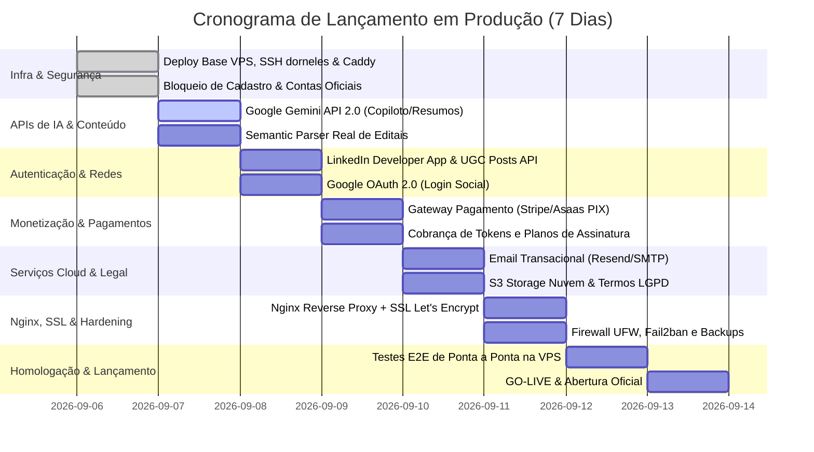

# 🚀 Roadmap de Produção, Deploy na VPS & Borda Caddy

Este documento consolida o planejamento executivo para o lançamento do **Academic Companion (`acad`)** em ambiente de produção definitivo, as práticas de segurança de borda recomendadas pela indústria, o isolamento dos serviços internos e o checklist operacional de infraestrutura na VPS.

---

## 🔒 1. Governança de Acesso na Fase Piloto Fechada

Para assegurar testes controlados e blindagem antes do go-live público, o cadastro aberto no sistema foi **estritamente bloqueado** no backend (`apps/backend/src/modules/auth/auth.service.ts`) e no frontend:

- **Trava de Registro no Backend:** Qualquer requisição pública para `POST /api/auth/register` retorna `HTTP 403 Forbidden` informando que novos cadastros estão suspensos durante o lançamento fechado.
- **Aviso Visual no Portal:** O formulário de registro em `Register.tsx` apresenta um banner informativo orientando os usuários não convidados sobre a fase piloto e disponibilizando acesso exclusivamente para quem já possui credenciais.
- **Contas Exclusivas Ativas no Banco de Produção:**

| Papel | E-mail Oficial | Usuário | Finalidade | Saldo Inicial |
|---|---|---|---|---|
| **Discente Oficial** | `fernando.dorneles@ecomp.ufsm.br` | `dorneles` | Validação de jornada, experiências, memórias e carteira de IA | 5.000 tokens |
| **Administrador Geral** | `admin.dorneles@acad.com` | `dorneles_admin` | Governança de fontes, moderação e auditoria | 9.999 tokens |

> [!IMPORTANT]
> O ambiente de desenvolvimento local (`localhost`) permanece com seus mocks e dados de desenvolvimento intactos para facilitar a criação contínua de testes. O ambiente de **Produção na VPS (`137.131.224.166`)** opera exclusivamente com o banco oficial PostgreSQL, migrations limpas e integrações reais.

---

## 🛡️ 2. Arquitetura de Borda & Segurança de Rede (Caddy Reverse Proxy)

Em conformidade com as melhores práticas de engenharia de software e segurança defensiva, portas de infraestrutura e servidores de aplicação **não são expostos diretamente para a internet pública (`0.0.0.0/0`)**.

### Topologia de Produção

```
               INTERNET PÚBLICA (0.0.0.0/0)
                           │
                 [Portas 80 / 443 / 81]
                           ▼
             ┌─────────────────────────────┐
             │   Caddy 2.9 (Borda / SSL)   │  ← Único ponto de contato com a internet
             └─────────────┬───────────────┘
                           │ (Rede Docker Isolada: acad_network)
         ┌─────────────────┼─────────────────┐
         ▼                 ▼                 ▼
   ┌───────────┐     ┌───────────┐     ┌───────────┐
   │ Frontend  │     │  Backend  │     │   Admin   │
   │  (Port 80)│     │(Port 5007)│     │  (Port 80)│
   └───────────┘     └─────┬─────┘     └───────────┘
                           │
             ┌─────────────┴─────────────┐
             ▼                           ▼
       ┌───────────┐               ┌───────────┐
       │ Postgres  │               │   MinIO   │
       │(Port 5432)│               │(Port 9000)│
       └───────────┘               └───────────┘
```

### Subdomínios Oficiais Ativos em Produção

Com a propagação dos registros DNS, o tráfego de borda é centralizado no Caddy sob conexões estritas **HTTPS com HTTP/2 e HTTP/3 (QUIC)**, certificados SSL emitidos e renovados automaticamente pela Let's Encrypt:

| Subdomínio Oficial | Roteamento Interno | Descrição | Status |
|---|---|---|---|
| `https://acad.dorneles.dev` | `acad_frontend_prod:80` | Portal do Discente (SPA React 19 + Nginx) | 🟢 Ativo (HTTP/2 200) |
| `https://admin-acad.dorneles.dev` | `acad_admin_prod:80` | Painel do Administrador (SPA React 19 + Nginx) | 🟢 Ativo (HTTP/2 200) |
| `https://api-acad.dorneles.dev` | `acad_backend_prod:5007` | API RESTful Express 5 + Swagger UI (`/api-docs/`) | 🟢 Ativo (HTTP/2 200) |
| `https://storage-acad.dorneles.dev` | `acad_minio_prod:9000` | MinIO S3 API (Storage de mídias e uploads) | 🟢 Ativo (HTTP/2 200) |
| `https://console-acad.dorneles.dev` | `acad_minio_prod:9001` | MinIO Console UI (Gestão visual do storage S3) | 🟢 Ativo (HTTP/2 200) |

### Princípios de Isolamento e Hardening
1. **Blindagem do Node.js (Porta 5007):**
   - O container `acad_backend_prod` não publica portas para o host da VPS. Ele só se comunica pela rede interna `acad_network`.
   - A porta `5007` está bloqueada externamente no firewall da VPS. Scanners externos recebem timeout/rejeição imediata.
2. **PostgreSQL (`5432`) e MinIO (`9000/9001`) Inacessíveis Externamente:**
   - Nenhum IP da internet pode tentar conexões diretas ou ataques de força bruta contra o banco de dados.
3. **Caddy como Ponto Único de Borda:**
   - Escuta exclusivamente nas portas `80` (HTTP com redirecionamento automático para HTTPS) e `443` (HTTPS com suporte a HTTP/2 e HTTP/3/QUIC).
   - Injeta cabeçalhos rígidos de segurança em todas as respostas (HSTS, nosniff, SAMEORIGIN, XSS-Protection).
4. **CORS Padronizado:**
   - O backend valida requisições CORS originadas de `https://acad.dorneles.dev` e `https://admin-acad.dorneles.dev`.


---

## 🗓️ 3. Cronograma Executivo de 7 Dias para o Go-Live



### 📍 D-7 (Domingo, 06/09) — Infraestrutura Base & Governança de Acesso [CONCLUÍDO]
- [x] **Atalho SSH:** Configurado `~/.ssh/config` para acesso via comando simples `ssh dorneles`.
- [x] **Bloqueio de Novos Registros:** Trava no backend (`auth.service.ts`) e banner no frontend (`Register.tsx`).
- [x] **Seed Oficial de Produção:** Criação de `fernando.dorneles@ecomp.ufsm.br` e `admin.dorneles@acad.com`.
- [x] **Caddy Proxy de Borda:** Implementado em `infra/caddy/` e integrado ao `Makefile`.
- [x] **Deploy Inicial na VPS:** Containers ativos e testados com HTTP 200 OK.

### 📍 D-6 (Segunda-feira, 07/09) — Substituição de Mocks por IA Real (Google Gemini API)
- [ ] Configuração do SDK oficial `@google/genai` e chave `GEMINI_API_KEY`.
- [ ] Conexão do Copiloto Acadêmico (`apps/backend/src/modules/assistant/`) ao modelo `gemini-2.5-flash`.
- [ ] Conexão do Resumo Inteligente de Editais (`opportunity.service.ts`) com extração de requisitos, benefícios e prazos.
- [ ] Conexão do LinkedIn Impact Builder (posts Técnicos, Storytelling e Executivos) à IA real.
- [ ] Telemetria de débitos de tokens reais na carteira do estudante (`UserWallet.tokenBalance`).

### 📍 D-5 (Terça-feira, 08/09) — Integração LinkedIn Developer Platform & Google OAuth 2.0
- [ ] Criação e verificação do aplicativo no portal `developer.linkedin.com`.
- [ ] Habilitação de produtos: *Share on LinkedIn* (UGC Posts) e *Sign In with LinkedIn using OpenID Connect*.
- [ ] Configuração de credenciais reais (`LINKEDIN_CLIENT_ID`, `LINKEDIN_CLIENT_SECRET`) e URL de Callback.
- [ ] Integração com Google Cloud Console para Login Social com Google (Google OAuth 2.0).

### 📍 D-4 (Quarta-feira, 09/09) — Gateway de Pagamentos, Assinaturas & Planos
- [ ] Ativação dos planos de monetização:
  - **Plano Gratuito (Free):** 50 tokens de boas-vindas + 20 por indicação.
  - **Plano Universitário Pro (R$ 19,90/mês ou R$ 14,90/mês semestral):** 500 tokens mensais, radar ilimitado, alertas prioritários e gerador LinkedIn completo.
  - **Plano Pesquisa & Laboratório (R$ 49,90/mês):** 2.000 tokens mensais, modelos Pro e exportação Lattes.
- [ ] Integração com gateway nacional (Asaas com PIX automático ou Stripe).
- [ ] Webhook de confirmação imediata de pagamento (`POST /api/webhooks/payment`) e liberação de saldo.

### 📍 D-3 (Quinta-feira, 10/09) — Email Transacional, Nuvem S3 & Termos Legais
- [ ] Integração com serviço de email transacional (Resend ou SMTP).
- [ ] Alertas automáticos de editais, confirmações de candidatura e notificações de saldo.
- [ ] Configuração de bucket S3 na nuvem (Cloudflare R2 ou AWS S3) para certificados e fotos.
- [ ] Páginas de Termos de Uso (`/terms`) e Política de Privacidade (`/privacy`) em conformidade com a LGPD.

### 📍 D-2 (Sexta-feira, 11/09) — Domínio Próprio, SSL Automático & Hardening
- [ ] Apontamento de DNS dos domínios oficiais para o IP `137.131.224.166`.
- [ ] Ativação automática de certificados SSL/TLS Let's Encrypt gerenciados pelo Caddy.
- [ ] Configuração de Fail2ban e rotina de backup diário do PostgreSQL (`pg_dump`) com retenção de 7 dias.

### 📍 D-1 (Sábado, 12/09) — Homologação & Testes de Carga na VPS
- [ ] Validação de ponta a ponta: autenticação, fluxo completo do LinkedIn, radar de editais e checkout de pagamento.
- [ ] Teste de carga e monitoramento de consumo de CPU/Memória na VPS Ampere ARM64.

### 📍 D-0 (Domingo, 13/09) — GO-LIVE & Abertura Oficial
- [ ] Verificação final de telemetria e integridade de todos os containers.
- [ ] Habilitação de cadastro público controlado (`ALLOW_PUBLIC_REGISTRATION=true`).
- [ ] Divulgação oficial e início das vendas de planos e pacotes de tokens.

---

## 🛠️ 4. Manual Operacional de Comandos (Makefile & SSH)

```bash
# 1. Acessar a VPS rapidamente:
ssh dorneles

# 2. Sincronizar alterações da máquina local para a VPS:
rsync -avz --exclude 'node_modules' --exclude '.next' --exclude 'dist' --exclude '.env.development' --exclude '.env.test' ./ dorneles:~/acad/

# 3. Na VPS, gerenciar a stack completa de produção:
cd ~/acad

# Iniciar toda a stack de produção com Caddy:
make prod-up

# Parar toda a stack de produção:
make prod-down

# Recarregar o Caddyfile sem downtime:
make caddy-reload

# Aplicar migrations no banco PostgreSQL de produção:
make migrate

# Visualizar logs em tempo real:
make logs-back
make logs-front
```

---

## 📌 5. Checklist de Portas na Oracle Cloud Security List

Para manter a segurança máxima da aplicação:
- **Portas que DEVEM estar ABERTAS (Ingress Rules 0.0.0.0/0):**
  - Porta `80` (TCP) — HTTP público (Caddy)
  - Porta `443` (TCP e UDP) — HTTPS seguro e HTTP/3 (Caddy)
  - Porta `81` (TCP) — Painel do Administrador (enquanto não houver subdomínio dedicado)
  - Porta `22` (TCP) — Acesso administrativo SSH com chave criptográfica
- **Portas que DEVEM PERMANECER FECHADAS (Bloqueadas):**
  - Porta `5007` (Node.js Express)
  - Porta `5432` (PostgreSQL)
  - Portas `9000` e `9001` (MinIO S3 Storage)
