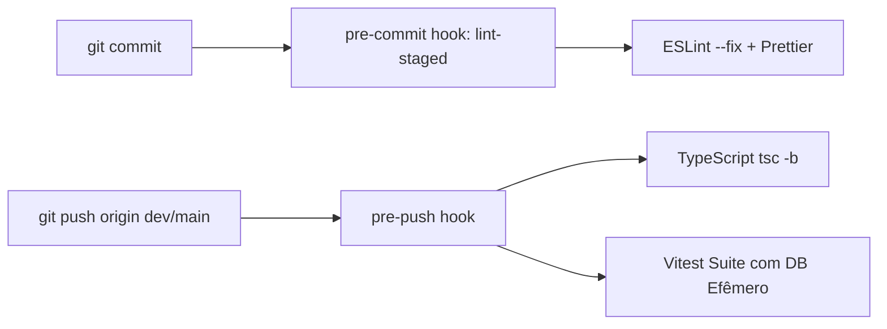

# 🛠️ CI/CD Local e Operação do Sistema

O **CMS Murais Digitais** utiliza uma esteira de **CI/CD 100% Local** focada em testes automatizados, verificação estrita de tipagem e entrega padronizada via Docker Compose V2 e BuildKit, tanto em computadores de desenvolvimento quanto em servidores VPS de produção.

---

## 🔍 1. Integração Contínua Local (CI Local)

A validação de qualidade é imposta através de Git Hooks gerenciados pelo **Husky** em todos os repositórios polyrepo:



### Hooks Configurados:
- **`packages/shared`:**
  - `pre-commit`: `npx lint-staged`
  - `pre-push`: `npm run build && npm run test`
- **`apps/backend`:**
  - `pre-commit`: `npx lint-staged`
  - `pre-push`: `npm run test` (sobe container de teste do PostgreSQL com tmpfs, executa migrations e roda Vitest)
- **`apps/frontend`:**
  - `pre-commit`: `npx lint-staged`
  - `pre-push`: `npm run build` (typecheck) + `npm run test`

---

## 🐳 2. Otimização Docker com BuildKit

Todos os builds utilizam **Docker BuildKit** (`DOCKER_BUILDKIT=1`) com montagem de cache de pacotes:

```dockerfile
# syntax=docker/dockerfile:1
...
# Cache mount para o diretório de pacotes do npm
RUN --mount=type=cache,target=/root/.npm npm install
```

Isso reduz o tempo de compilação de novas imagens em até **80%**, reutilizando pacotes inalterados entre builds.

---

## 📖 3. Tabela de Comandos Operacionais (`Makefile`)

| Comando | Descrição | Ambiente Recomendado |
|---|---|---|
| `make sync-dev` | Puxa a branch `dev` na raiz e em todos os submódulos | Desenvolvimento |
| `make sync-main` | Puxa a branch `main` na raiz e em todos os submódulos | Produção (VPS) |
| `make ci-local` | Executa linting, typechecking e testes em toda a stack | Dev / VPS |
| `make build-all` | Compila o shared e constrói imagens Docker com BuildKit | Dev / VPS |
| `make dev-upd` | Inicia o ecossistema de desenvolvimento em background | Desenvolvimento |
| `make dev-up` | Inicia com logs interativos anexados ao terminal | Desenvolvimento |
| `make dev-down` | Derruba containers de desenvolvimento | Desenvolvimento |
| `make dev-reset` | Derruba containers e apaga volumes do banco (zera o estado) | Desenvolvimento |
| `make cd-local` | Pipeline completa de dev: pull `dev` → CI → build → up → migrate → prune | Desenvolvimento |
| `make prod-up` | Inicia a stack de produção com Nginx e Backend compilado | Produção (VPS) |
| `make prod-down` | Derruba a stack de produção | Produção (VPS) |
| `make cd-prod` | Pipeline de deploy VPS: pull `main` → CI → build → prod-up → migrate → prune | Produção (VPS) |
| `make logs` | Visualiza logs combinados de todos os containers | Dev / VPS |
| `make migrate` | Executa migrations do Prisma dentro do Docker | Dev / VPS |
| `make clean-all` | Limpeza profunda de volumes, órfãos e imagens antigas | Dev / VPS |
