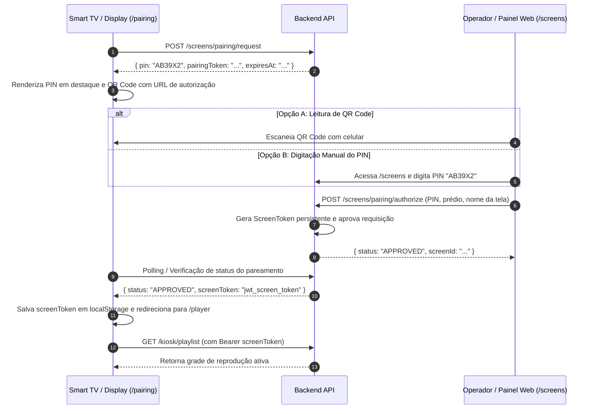

# 📺 Fluxo de Pareamento de Displays (PIN & QR Code)

Um dos diferenciais técnicos do **CMS Murais Digitais** é o seu fluxo de **pareamento automatizado de novas Smart TVs**, totens e monitores institucionais. O objetivo é permitir que qualquer display seja instalado e vinculado a um prédio específico sem necessidade de digitação complexa de senhas na TV.

---

## 🔄 Protocolo de Handshake em 5 Etapas

---

## 🔍 Detalhamento das Etapas

### 1. Abertura do Player Kiosk na TV
Ao ser ligada pela primeira vez, a TV acessa a rota pública `/pairing` do frontend. O sistema verifica se existe um token de tela salvo no armazenamento local (`localStorage.getItem('screenToken')`).
- Se existir um token válido, a TV é redirecionada imediatamente para `/player`.
- Se não existir, inicia o processo de pareamento.

### 2. Geração do PIN Temporário
O player dispara uma requisição `POST /screens/pairing/request` para o backend:
- O servidor gera um PIN alfanumérico único de **6 caracteres em caixa alta** (exemplo: `K9X2B4`).
- Cria um registro no banco de dados com expiração automática (padrão de 15 minutos).
- Devolve o PIN e o ID da requisição para a TV.

### 3. Exibição Visual (PIN + QR Code)
A interface do display renderiza:
- O **PIN de 6 dígitos** com alta legibilidade para visualização à distância.
- Um **QR Code dinâmico** contendo a URL de autorização direta do painel administrativo com o PIN pré-preenchido.

### 4. Autorização pelo Operador Autenticado
O operador credenciado (com papel `SUPER_ADMIN` ou `CENTER_ADMIN` do centro correspondente):
- Escaneia o QR Code ou abre a tela `/screens` no painel web.
- Informa o PIN exibido na tela, seleciona o Centro Universitário, o Prédio onde a TV está fisicamente localizada e define um nome amigável (ex: *"Hall de Entrada - Prédio 7"*).
- Envia `POST /screens/pairing/authorize`.

### 5. Emissão do Screen Token e Reprodução Automática
- O backend associa a tela ao prédio, altera o status da requisição para `APPROVED` e emite um **token JWT persistente de tela (`screenToken`)**.
- A TV detecta a aprovação, grava o `screenToken` com segurança no navegador e transiciona automaticamente para a rota `/player`.
- O player inicia a execução da playlist do prédio (`GET /kiosk/playlist`) em tela cheia.
